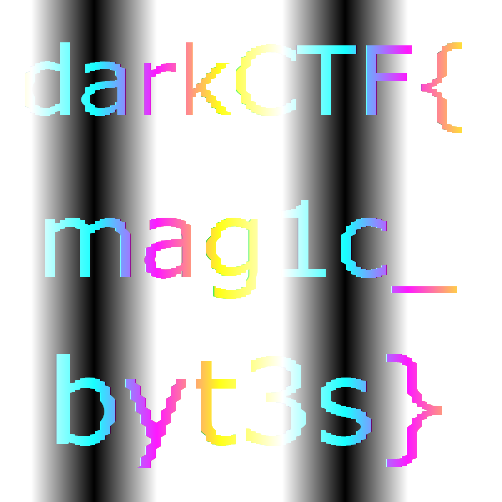

# DarkCTF 2020 – QuickFix

* **Category:** misc
* **Points:** 449

## Challenge

> Magic is in the air! Want a byte of it? file

## Solution

The challenge gives you a [zip file](QuickFix.zip) with several "broken" JPG images. 

The challenge text allows you to understand that maybe the *magic byte* was altered somehow. So you can discover that images are PNG files with JPG signature.

Furthermore, files have a name with the following format: `flag_<value-1>_<value-2>.jpg`, so you can discover that each file will represent a tile in a bigger image.

You can write a [script](quickfix.py) to automate the image fix and the composition.

```python
import time
import datetime
import png
import os

TOTAL_FRAGMENTS = 100
FRAGMENT_DIMENSION = 20
SOURCE_PATH = "./QuickFix/"
DESTINATION_PATH = "./Fixed_{}/"
FILE_NAME = "flag_{}_{}.{}"


def fix_images():
    print("[*] Creating fixed images directory structure.")
    timestamp_string = datetime.datetime.fromtimestamp(time.time()).strftime('%Y-%m-%d_%H-%M-%S')
    fixed_images_directory = DESTINATION_PATH.format(timestamp_string)
    os.mkdir(fixed_images_directory)
    print("[*] Fixed images directory is '{}'.".format(fixed_images_directory))
    print("[*] Reading files to fix.")
    for y in range(TOTAL_FRAGMENTS):
        for x in range(TOTAL_FRAGMENTS):
            file_to_fix = SOURCE_PATH + FILE_NAME.format(x, y, "jpg")
            print("[*] Considering file '{}'.".format(file_to_fix))
            fr = open(file_to_fix, "rb")
            fixed_file = fixed_images_directory + FILE_NAME.format(x, y, "png")
            print("[*] Writing to file '{}'.".format(fixed_file))
            fw = open(fixed_file, "wb")
            read_bytes = fr.read()
            print("[*] Original content: {}.".format(read_bytes))
            # Transforming from JPG to PNG via "Magic Number" change.
            fixed_bytes = read_bytes.replace(b'\xff\xd8\xff\xe0\x00\x10JFIF\x00\x00\x00\r', b'\x89\x50\x4e\x47\x0d\x0a\x1a\x0a\x00\x00\x00\x0d')
            print("[*] Fixed content: {}.".format(fixed_bytes))
            fw.write(fixed_bytes)
            fr.close()
            fw.close()
    return fixed_images_directory


def compose_final_image(fixed_images_directory):
    print("[*] Composing final image.")
    flag = open("./flag.png", "wb")
    w = png.Writer(height=TOTAL_FRAGMENTS * FRAGMENT_DIMENSION, width=TOTAL_FRAGMENTS * FRAGMENT_DIMENSION, alpha=True)
    image_all_pixels = []
    for row in range(TOTAL_FRAGMENTS * FRAGMENT_DIMENSION):
        image_all_row_pixels = []
        for column in range(TOTAL_FRAGMENTS * FRAGMENT_DIMENSION):
            y = row // FRAGMENT_DIMENSION
            x = column // FRAGMENT_DIMENSION
            fragment_file = fixed_images_directory + FILE_NAME.format(x, y, "png")
            print("[*] Considering file '{}'.".format(fragment_file))
            fr = png.Reader(filename=fragment_file)
            fragment_all_pixels = list(fr.read_flat()[2])
            fragment_pixel_row = row % FRAGMENT_DIMENSION
            fragment_pixel_column = column % FRAGMENT_DIMENSION    
            position = fragment_pixel_column + (fragment_pixel_row * 4 * FRAGMENT_DIMENSION)
            fragment_pixel_rgba = fragment_all_pixels[position:position+4]
            for channel in fragment_pixel_rgba:
                image_all_row_pixels.append(channel)
        image_all_pixels.append(tuple(image_all_row_pixels)) # Each row is a tuple into a different list item.
    w.write(flag, image_all_pixels)
    flag.close()  


# Main execution.
if __name__ == "__main__":
    print("Misc/QuickFix solver.")
    fixed_images_directory = fix_images()
    compose_final_image(fixed_images_directory)
```

The final image will give you the flag.



```
darkCTF{mag1c_byt3s}
```